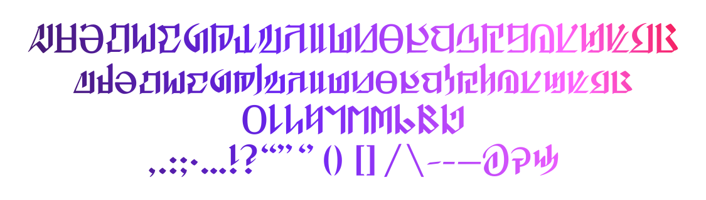
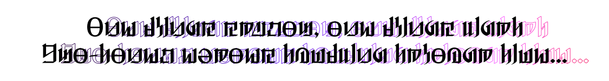
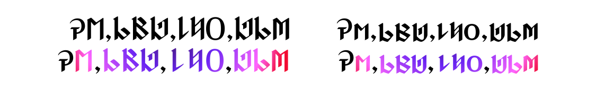

# Augmented Norvrandt

[中文介绍](README_CN.md)

**Fanmade** typeface, greetings from the First.

A re-work of the Norvrandt alphabets with extended language support and Opentype features.

## Glyphs Preview

Currently supports:
- Basic Latin alphabets (A-Z, a-z)
- Diacritics latin alphabets (🇫🇷, 🇩🇪 and more!)
- Numbers (0-9)
- Basic punctuations and symbols
- and more (…?)

## Windows Compatibility

See [Issue here](https://github.com/karaipsum/Postulated-Proto-Alphabet/issues/1#issue-2312178558)

TL;DR: If you couldn't open or install the font, please use the files with a prefix of [W].

## Kerning Preview

> _One brings shadow, one brings light_
> 
> _Two-toned echoes tumbling through time…_
> 
> Excerpt from lyrics of [_Shadowbringers_](https://na.finalfantasyxiv.com/blog/002805.html)

Manually adjusted kerning pairs for improved readability. Toggle "Metrics" setting in your preferred design software to apply.

## Opentype Features Support (default off)

Below are currently supported Opentype features. They are based on my personal idea and interpretation, which I haven't noticed in official arkworks so far. They are **off** by default. You may turn it on for fun.

### Case-Sensitive Forms `case`

> ¿Qué pasa? **¿** QUÉ PASA? 
> 
> ¡Qué pasa! **¡** QUÉ PASA!
>
> Emet-Selch EMET **-** SELCH

When switching to all caps form, certain punctuation marks, currently `¿`, `¡` and `-` (hyphen), will switch to an alternate form. In this case, they will shift upwards to fit in the lines.

### Old-style Figures `onum`

> $_**5,789,130,976**_

### Tabular Figures `tnum`

> $_**5,789,130,976**_

### Stylistic Alternates `salt`

> « : * & »

## Source

- Norvrandt alphabet from [_Encyclopaedia Eorzea III - The World of FINAL FANTASY XIV -_](https://sqex.to/Snrq9) by SQUARE ENIX CO., LTD.
> The lowercase of the Norvrandt alphabet in the first printing of the book is incorrect. Square Enix posted the content correction on their website.
- [Norvrandt alphabet reference table](https://weibo.com/2797031154/L3ClPoe87) by [@考伦_Kawlen](https://weibo.com/u/2797031154)

## License

All company, product, and system names mentioned herein are trademarks or registered trademarks of their respective companies.

Augmented Norvrandt is licensed under the [MIT](LICENSE) License.

## Footnote

Feel free to post suggestions and/or any issues here.