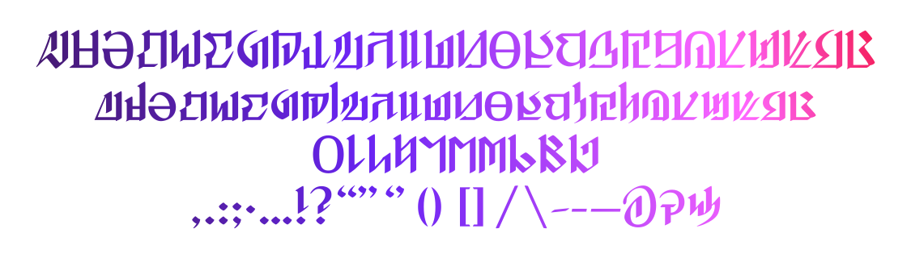

# 改良型诺弗兰特文字

[ReadMe](README.md)

**非官方自制**字体，欢迎来到第一世界！

改良型诺弗兰特文字进行了再设计，增加了更多语言支持与 Opentype 特性。

## 字符预览

当前支持：
- 基础拉丁字母 (A-Z, a-z)
- 带变音符号的拉丁字母 (对🇫🇷 🇩🇪 等语言的支持)
- 数字 (0-9)
- 常用标点与符号
- 以及……？

## 字偶间距预览

> _One brings shadow, one brings light_
> 
> _Two-toned echoes tumbling through time…_
> 
> 引自 [《Shadowbringers　-暗影使者-》]https://na.finalfantasyxiv.com/blog/002805.html) 的歌词。

手工调节了字偶间距设定以提高可读性。可以在你喜欢的设计软件中选择“原始设定”以启用。

## Opentype 特性支持（默认关闭）

以下是当前支持的 Opentype 特性。设计上非常主观诠释，官方的材料中目前个人并没有看到类似的设计。所以以下特性均默认**关闭**，可以自行开启玩玩看。

### Case-Sensitive Forms `case`

> ¿Qué pasa? **¿** QUÉ PASA? 
> 
> ¡Qué pasa! **¡** QUÉ PASA!
>
> Emet-Selch EMET **-** SELCH

当切换到全部大写模式时，部分标点符号（当前支持`¿`, `¡` and `-` (连字符)）会切换到替代样式，即向上移动以匹配。

### 旧体数字 `onum`

> $_**5,789,130,976**_

### 表格数字（等宽） `tnum`

> $_**5,789,130,976**_

### 样式替代 `salt`

> « ： * & »

## 参考与来源

- 诺弗兰特字母表 [_Encyclopaedia Eorzea III - The World of FINAL FANTASY XIV -_](https://sqex.to/Snrq9) by SQUARE ENIX CO., LTD. | 《艾欧泽亚百科全书III》（暂未公布）
> 第一版的书中，诺弗兰特字母表的小写字母有印刷错误，官网上有给出修正图片。
- [@考伦_Kawlen](https://weibo.com/u/2797031154) 老师制作的 [诺弗兰特文字表](https://weibo.com/2797031154/L3ClPoe87)

## 授权

此处提及的所有公司、产品和系统名称均为其各自公司的商标或注册商标。

改良型诺弗兰特文字以 [MIT](LICENSE) License 开源。

## 尾声

欢迎在 Issues 里提出建议或错误。